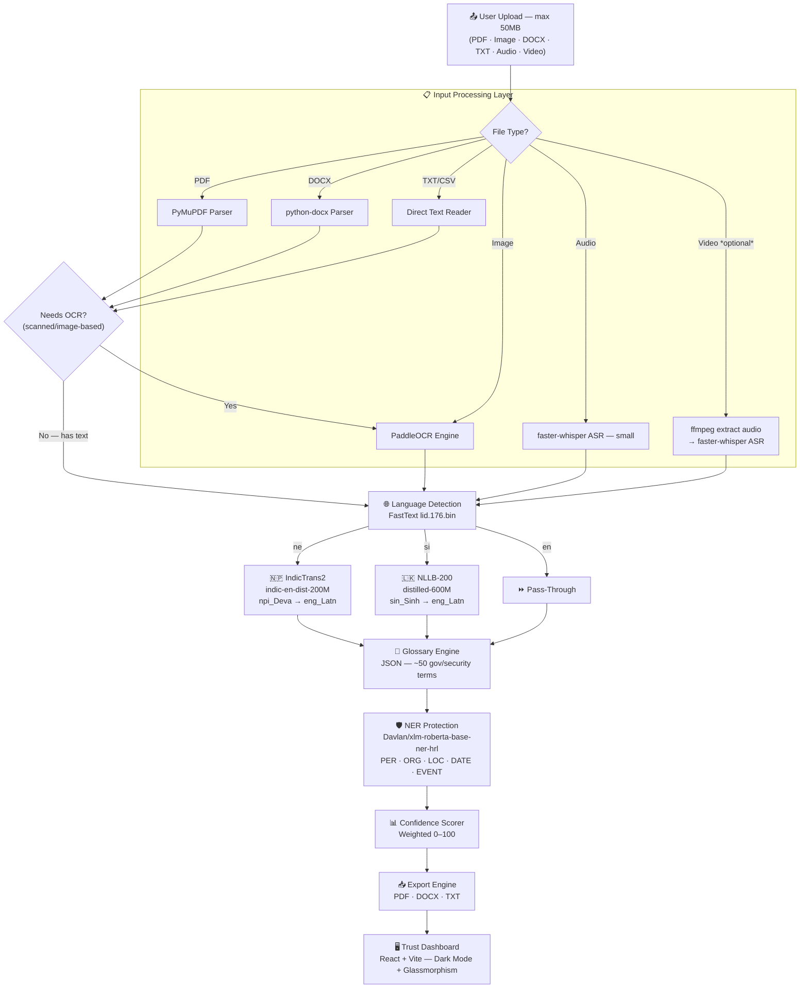

# NeuroTranslate — Final Implementation Plan (APPROVED)

> [!IMPORTANT]
> **Architecture FULLY APPROVED. Implementation begins immediately.**
> All decisions are final. No further design questions will be asked.

---

## Implementation Priority (APPROVED ORDER)

| Priority | Feature |
|---|---|
| 1 | **PDF Support** — PyMuPDF + PaddleOCR |
| 2 | **Image Support** — PaddleOCR (PNG/JPG/TIFF/BMP/WEBP) |
| 3 | **Translation Pipeline** — IndicTrans2 + NLLB-200 |
| 4 | **Confidence Dashboard** — React Trust Dashboard |
| 5 | **DOCX Support** — python-docx |
| 6 | **Export Support** — PDF + DOCX + TXT |
| 7 | **NER** — XLM-RoBERTa Base NER HRL |
| 8 | **Glossary** — JSON Dictionary Engine |
| 9 | **Audio Support** — faster-whisper (MP3/WAV/M4A/OGG/FLAC) |
| 10 | **Video Support** *(optional, time permitting)* — ffmpeg + Whisper |

---

## Final Model Decisions (LOCKED)

| Layer | Technology | Model | Status |
|---|---|---|---|
| OCR | PaddleOCR | Multilingual default | ✅ FINAL |
| Language Detection | FastText | `lid.176.bin` | ✅ FINAL |
| Nepali Translation | IndicTrans2 | `ai4bharat/indictrans2-indic-en-dist-200M` | ✅ FINAL |
| Sinhala Translation | NLLB-200 | `facebook/nllb-200-distilled-600M` | ✅ FINAL |
| NER | XLM-RoBERTa | `Davlan/xlm-roberta-base-ner-hrl` | ✅ FINAL |
| Glossary | JSON Dictionary | `backend/data/glossary.json` | ✅ FINAL |
| ASR (Audio) | faster-whisper | `small` multilingual | ✅ FINAL |
| ASR (Video) | ffmpeg + faster-whisper | `small` multilingual | ⚙️ Optional |

## Technology Stack (LOCKED)

| Tier | Technology | Status |
|---|---|---|
| Backend | **FastAPI** + Uvicorn | ✅ FINAL |
| Frontend | **React + Vite** | ✅ FINAL |
| Database | **PostgreSQL** (SQLAlchemy async + asyncpg) | ✅ FINAL |
| Upload Limit | **50 MB** | ✅ FINAL |
| Model Loading | Lazy + HuggingFace cache + CUDA auto-detect + CPU fallback | ✅ FINAL |

---

## Supported Input Formats

| Format | Extensions | Priority |
|---|---|---|
| 📄 PDF | `.pdf` | 1 — Core |
| 🖼️ Image | `.png`, `.jpg`, `.jpeg`, `.tiff`, `.bmp`, `.webp` | 2 — Core |
| 📝 DOCX | `.docx` | 5 — Standard |
| 📃 Plain Text | `.txt`, `.csv` | 5 — Standard |
| 🎙️ Audio | `.mp3`, `.wav`, `.m4a`, `.ogg`, `.flac` | 9 — Extended |
| 🎥 Video | `.mp4`, `.avi`, `.mov`, `.mkv` | 10 — Optional |

---

## Language Routing Rules (FINAL)

```python
if language == "ne":   # Nepali → IndicTrans2 (npi_Deva → eng_Latn)
if language == "si":   # Sinhala → NLLB-200 (sin_Sinh → eng_Latn)
if language == "en":   # English → pass-through, no translation needed
```

---

## Full Pipeline Architecture



---

## Confidence Engine Weights (FINAL)

| Signal | Weight |
|---|---|
| Translation Quality (log-probs) | **50%** |
| NER Entity Preservation | **20%** |
| Glossary Match Preservation | **15%** |
| Language Detection Confidence | **15%** |

| Score Range | Category |
|---|---|
| 90 – 100 | ✅ High Confidence |
| 70 – 89 | ⚠️ Moderate Confidence |
| Below 70 | 🔴 Needs Human Review |

---

## RAM Budget (8GB Laptop — VERIFIED)

| Component | RAM | Notes |
|---|---|---|
| Windows OS | ~2.5 GB | Always running |
| Python + FastAPI | ~0.5 GB | Always running |
| PaddleOCR | ~0.3 GB | Loaded on use |
| FastText lid.176.bin | ~0.13 GB | Tiny |
| faster-whisper (small) | ~0.5 GB | Audio/video only |
| IndicTrans2 dist-200M | ~0.5 GB | Nepali only, lazy |
| NLLB-200 dist-600M | ~1.2 GB | Sinhala only, lazy |
| XLM-RoBERTa base NER | ~1.1 GB | Post-translation |
| **Peak (Sinhala path)** | **~6.2 GB** | ✅ Fits in 8GB |

> Both translation models are loaded **lazily** — never both in RAM simultaneously.

---

## Complete File Tree

```
Makeathon/
│
├── backend/
│   ├── main.py                          # FastAPI app, CORS, startup events
│   ├── config.py                        # All settings, device detection
│   ├── requirements.txt                 # All Python dependencies
│   │
│   ├── routers/
│   │   ├── __init__.py
│   │   ├── translate.py                 # POST /api/translate
│   │   ├── jobs.py                      # GET  /api/jobs/{job_id}
│   │   └── download.py                  # GET  /api/download/{job_id}/{fmt}
│   │
│   ├── services/
│   │   ├── __init__.py
│   │   └── job_service.py               # Job CRUD + PostgreSQL
│   │
│   ├── pipeline/
│   │   ├── __init__.py
│   │   ├── orchestrator.py              # Master pipeline controller
│   │   ├── document_parser.py           # PDF / DOCX / TXT parsing
│   │   ├── ocr_engine.py                # PaddleOCR wrapper
│   │   ├── asr_engine.py                # faster-whisper (audio + video)
│   │   ├── language_detector.py         # FastText lid.176.bin
│   │   ├── translator.py                # IndicTrans2 + NLLB-200 lazy load
│   │   ├── glossary_engine.py           # JSON glossary enforcement
│   │   ├── ner_engine.py                # XLM-RoBERTa NER
│   │   ├── confidence_scorer.py         # Weighted confidence engine
│   │   └── export_engine.py             # PDF + DOCX + TXT export
│   │
│   ├── models/
│   │   ├── __init__.py
│   │   └── schemas.py                   # Pydantic request/response schemas
│   │
│   ├── database/
│   │   ├── __init__.py
│   │   ├── connection.py                # SQLAlchemy async engine
│   │   └── models.py                    # ORM: jobs, results tables
│   │
│   ├── utils/
│   │   ├── __init__.py
│   │   ├── file_handler.py              # Upload validation + temp storage
│   │   └── logger.py                    # Loguru structured logging
│   │
│   └── data/
│       └── glossary.json                # NE/SI terminology dictionary
│
├── frontend/
│   ├── package.json
│   ├── vite.config.js
│   ├── index.html
│   └── src/
│       ├── main.jsx
│       ├── App.jsx
│       ├── index.css                    # Dark-mode design system tokens
│       ├── components/
│       │   ├── UploadZone.jsx           # Drag-and-drop (all 6 format types)
│       │   ├── FormatBadges.jsx         # Format icons + accepted types
│       │   ├── PipelineProgress.jsx     # Animated 8-stage pipeline tracker
│       │   ├── TranslationView.jsx      # Side-by-side source vs translated
│       │   ├── TrustDashboard.jsx       # Master confidence dashboard
│       │   ├── ConfidenceGauge.jsx      # Animated SVG gauge 0–100
│       │   ├── EntityHighlighter.jsx    # NER colour-coded entity overlays
│       │   ├── GlossaryPanel.jsx        # Glossary replacement audit trail
│       │   ├── AudioPlayer.jsx          # Embedded audio/video preview
│       │   └── ExportButtons.jsx        # PDF / DOCX / TXT download
│       └── services/
│           └── api.js                   # Axios API client
│
├── uploads/                             # Temporary upload storage (gitignored)
├── .env.example                         # Environment variable template
└── README.md                            # Setup and run instructions
```

---

## Implementation Steps (Active Build Order)

| # | Step | Key Files | Status |
|---|---|---|---|
| 1 | Project structure | Directories + `__init__.py` files | ⏳ |
| 2 | requirements.txt | `backend/requirements.txt` | ⏳ |
| 3 | config.py | `backend/config.py` | ⏳ |
| 4 | Database layer | `database/connection.py`, `database/models.py` | ⏳ |
| 5 | Pydantic schemas | `models/schemas.py` | ⏳ |
| 6 | Utilities | `utils/file_handler.py`, `utils/logger.py` | ⏳ |
| 7 | FastAPI core | `main.py`, all routers, `job_service.py` | ⏳ |
| 8 | Document parser | `pipeline/document_parser.py` | ⏳ |
| 9 | OCR engine | `pipeline/ocr_engine.py` | ⏳ |
| 10 | ASR engine | `pipeline/asr_engine.py` | ⏳ |
| 11 | Language detector | `pipeline/language_detector.py` | ⏳ |
| 12 | Translator (both) | `pipeline/translator.py` | ⏳ |
| 13 | Glossary engine | `pipeline/glossary_engine.py` + `data/glossary.json` | ⏳ |
| 14 | NER engine | `pipeline/ner_engine.py` | ⏳ |
| 15 | Confidence scorer | `pipeline/confidence_scorer.py` | ⏳ |
| 16 | Export engine | `pipeline/export_engine.py` | ⏳ |
| 17 | Pipeline orchestrator | `pipeline/orchestrator.py` | ⏳ |
| 18 | React + Vite frontend | All `frontend/src/` files | ⏳ |
| 19 | Backend + frontend integration | CORS, Vite proxy, API wiring | ⏳ |
| 20 | Deployment prep | `.env.example`, `README.md` | ⏳ |

---

## Pre-Build Verification Checklist

- ✅ `ai4bharat/indictrans2-indic-en-dist-200M` — verified on HuggingFace Hub
- ✅ `facebook/nllb-200-distilled-600M` — verified on HuggingFace Hub
- ✅ `Davlan/xlm-roberta-base-ner-hrl` — verified, labels: PER/ORG/LOC/DATE
- ✅ `npi_Deva` — correct IndicTrans2 Nepali source language code
- ✅ `sin_Sinh` — correct NLLB-200 Sinhala source language code
- ✅ `eng_Latn` — correct English target language code for both models
- ✅ `faster-whisper` supports Nepali + Sinhala speech recognition
- ✅ `ftlangdetect` auto-manages `lid.176.bin` download
- ✅ `IndicTransToolkit` required — installed via pip from GitHub
- ✅ `paddlepaddle` separate from PyTorch — no conflict on CPU install
- ✅ Lazy loading — never both translation models in RAM simultaneously
- ✅ CUDA auto-detect → CPU fallback via `torch.cuda.is_available()`
- ✅ PostgreSQL async via `asyncpg` + SQLAlchemy 2.0
- ✅ All uploads validated: extension + MIME type + size ≤ 50MB
- ✅ ReportLab for PDF export; python-docx for DOCX formatting
